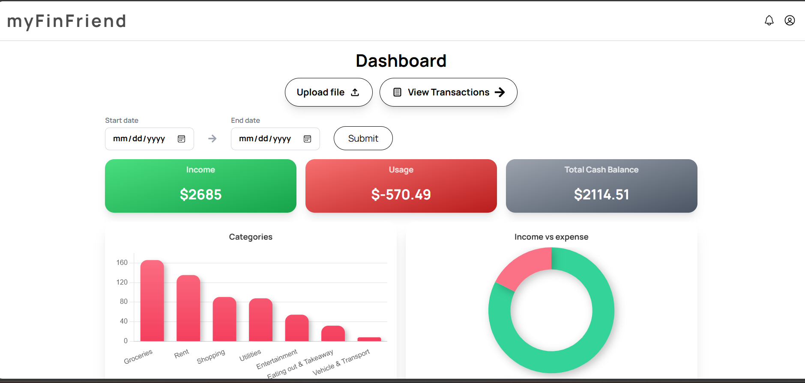
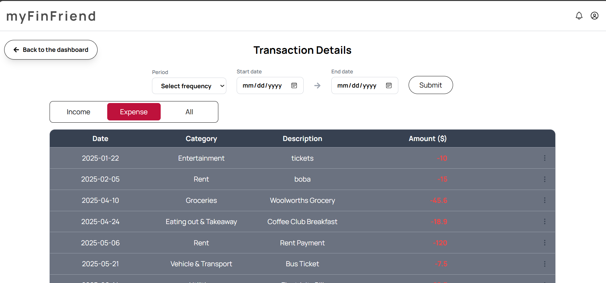
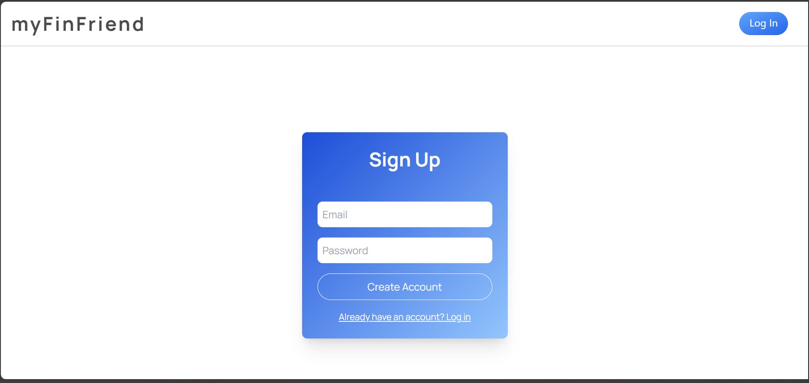
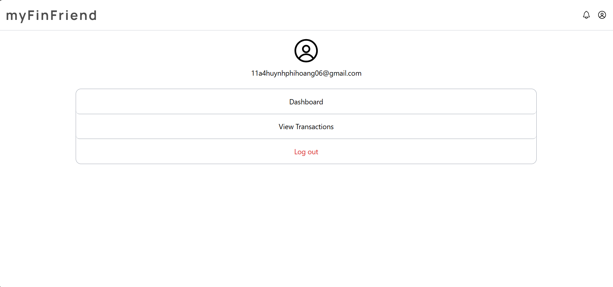
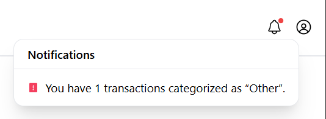
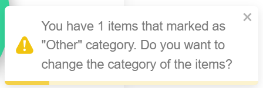
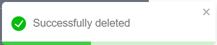

# myFinFriend
A personal financial management web-app that integrates AI-powered tools to keep on track of your spending and budget

---

# Technologies Used

---

# Steps to run the website locally

## Setting up and downloading dependencies
- Clone the repository into your local device
- Install necessary libraries and dependencies: 'pip install -r requirements.txt'
  
## Frontend
- Navigate to the folder "frontend" and then type `npm install` to install required frontend libraries.
- Finally, type `npm start` to start the website.

## Backend
- Type `python main` to run the backend while running the frontend.

---

# Website Snapshots

## Dashboard page

- The main page where users can upload files (.csv or .pdf) to the website.
- Users can select a start date and end date to view income, expenses, and balance within a specific time range.
- A reset filter option is available to clear the selected date range.
- Five key financial insights are displayed:
    - Total Income
    - Total Expense
    - Balance
    - Expense Categories
    - Income vs Expense Comparison
- Navigation buttons are provided to access other pages, including View Transactions and the Profile (avatar icon)

## Details page

- Users can analyse their finances using a date range and frequency filter (weekly, monthly, or quarterly).
- This helps users understand spending patterns over time.
- A reset filter button allows users to clear all inputs easily.
- Toggle buttons let users switch between three tables:
    - Income
    - Expense
    - All Transactions
- Users can create, edit, and delete transactions directly from this page.
- Each action (create,edit,delate), the user can receive notification to know if the action is successful.

## Sign-Up & Log-In page

- Allows new users to create an account.
- Existing users can log in to access their personal finance data.
- Users can easily switch between the sign-up and log-in pages.

## Profile page

- Displays the currently logged-in account information.
- Provides quick navigation to the Dashboard and Transaction Details pages.
- Users can log out, with a confirmation notification: “Successfully logged out”.

## Notification

- Inform the user about the transactions that marked as "Other" by Google GenAI.
- Update the notification in the real-time if a transaction marked "Other" is changed, deleted and created.
- Allow the user the open and close the information box of the notification.

## Pop-up notification

- Provides real-time feedback to users when actions are completed successfully or require attention (e.g., create, update, delete operations).
- Enhances user experience by clearly confirming system responses and reducing uncertainty.
- Displays contextual notifications, including the number of transactions categorized as “Other”, helping users quickly identify uncategorized or exceptional records.

---

# Data Schemas and Backend Configuration
## Supabase Schemas
1. category_list

| Column Name   | Data Type | Notes          |
| ------------- | --------- | -------------- |
| category_id   | INT2      | Primary Key    |
| category_name | VARCHAR   | Category label |

This table keeps the list of default categories a record can be put into. 
**Future Improvements**: Allowing users to be able to choose from the default list AND adding their own categorisation.

2. transaction_history

| Column Name         | Data Type | Notes                                 |
| ------------------- | --------- | ------------------------------------- |
| transaction_id      | INT8      | Primary Key                           |
| user_id             | UUID      | FK → auth.users                       |
| transaction_amount  | FLOAT4    | Negative = expense, positive = income |
| transaction_details | VARCHAR   | Description                           |
| transaction_date    | DATE      | Transaction date                      |
| transaction_category_id         | INT2      | FK → category_list.category_id        |

This table stores the records of each users' transaction, is the central of myFinFriend. 
Analytical insights are produced using data from this source.
**Future Expansion**: Integrating an AI Agent to produce analytics, charts and insights just from user's prompt.

3. upload_storage

| Column Name   | Data Type | Notes                    |
| ------------- | --------- | ------------------------ |
| upload_id     | INT8      | Primary Key              |
| user_id       | UUID      | FK → auth.users          |
| upload_status | VARCHAR   | e.g. pending / processed |
| created_at    | TIMESTAMP | Upload time              |
| storage_path  | TEXT      | Supabase storage path    |

This table serves as a processing queue for the API calls for documentation uploads preventing overloading the API calls to an external AI model.
It is also used to automatically cleaned expired documents, which is customizable. For example, it can be set to clean up every 30 minutes or every 3 days.

## Supabase RLS Policy
The following RLS policies have been set using PostgreSQL:
- Users can **only read their own rows**.
- Users can **insert new rows for themselves**.
- Users can **update their own rows**.
- Users can **delete their own rows**
- Users *cannot* access/read/update other users' rows
- Backend (server) has access to every users' rows.

